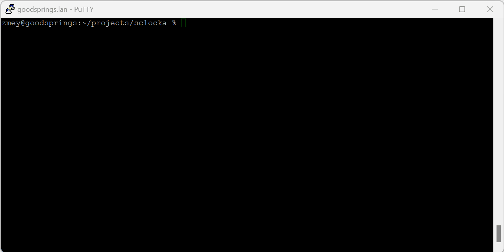

# Sclocka

## Screen saver/lock for terminals

<a href="https://www.buymeacoffee.com/mezantrop" target="_blank"></a>

Protect your terminal with a screensaver and lock it with a password. `Sclocka` runs on *BSD, macOS and Linux

If you are more interested in a screensaver than a screenlock, check [ASCII Saver - Screensaver for terminals](https://gitlab.com/mezantrop/ascsaver)



### Features and TODO list

- [x] Plain screensaver mode *(no password)*
- [x] Password protection via PAM (Pluggable Authentication Modules)
- Supported platforms:
  - [x] Linux
  - [x] macOS
  - [x] FreeBSD, NetBSD
  - [ ] Others to be done
- [ ] *Optional*. Integration with popular shells as a standard feature (?)
- [ ] *Optional*. More screensaver animation types
- [ ] Packages/ports
- [ ] Documentation

[Changelog](CHANGELOG.md)

[Issues](https://github.com/mezantrop/sclocka/issues)

### Thanks to

[Contributors](CONTRIBUTORS.md)

### Build and install

Build Requirements

- CLANG or GCC
- make
- PAM development libraries

#### FreeBSD

`# make install clean`

Note, the default `login` PAM service on FreeBSD doesn't check a user's password for the same login. To allow `sclocka`
perform password authentication via PAM, install [unix-selfauth-helper](https://github.com/Zirias/unix-selfauth-helper):

```sh
# pkg install unix-selfauth-helper
```

Create and configure a special PAM service e.g. /etc/pam.d/sclocka:

```
auth            sufficient      pam_exec.so             return_prog_exit_status expose_authtok /usr/local/libexec/unix-selfauth-helper
auth            include         system
account         include         system
```

Start `sclocka` with `-P sclocka` option:

```sh
$ sclocka -P sclocka
```

#### NetBSD

`# make install clean`

See notes about PAM helper from FreeBSD section

#### macOS

`# make install clean`

Note, you may be prompted to install command line developer tools

#### Debian flavor Linux

Make sure you have everything to compile sources:

```sh
$ sudo apt-get install build-essential
$ sudo apt-get install libpam0g-dev

$ sudo make install clean
```

#### Red Hat based Linux

Make sure you have everything to compile sources:

```sh
$ sudo dnf groupinstall "Development Tools"
$ sudo dnf install pam-devel

$ sudo make install clean
```

### Run

`# sclocka`

Wait for a screensaver to appear

#### Options

`Sclocka` can be envoked with several options:

```sh
$ sclocka -h

Sclocka - screen saver/lock for terminals, v1.0

Usage:
        sclocka [-b n|b|c] [-c] [-i n] [-s n] [-p] [-P service] [-h]

[-b b]          Method to restore the screen: (n)one, (b)uffer, (c)apabilities
[-c]            Do not clear the window
[-i 5]          Wait n minutes before launching the screensaver
[-s 64]         Screensaver speed n in milliseconds

[-p]            Disable PAM password check
[-P login]      Set custom PAM service

[-h]            This message
```

### Contacts

Not so early stage of development, yet don't expect everything to work properly. If you have an idea, a question,
or have found a problem, do not hesitate to open an issue or mail me: Mikhail Zakharov <zmey20000@yahoo.com>
