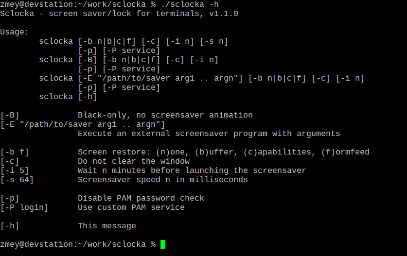

# Sclocka

## Screen saver/lock for terminals

<a href="https://www.buymeacoffee.com/mezantrop" target="_blank"></a>

Protect your terminal with a screensaver and lock it with a password. `Sclocka` runs on *BSD, macOS and Linux

If you are more interested in a screensaver than a screenlock, check [ASCII Saver - Screensaver for terminals](https://gitlab.com/mezantrop/ascsaver)



### Features and TODO list

- [x] Plain screensaver mode *(no password)*
- [x] Password protection via PAM (Pluggable Authentication Modules)
- Supported platforms:
  - [x] Linux
  - [x] macOS
  - [x] FreeBSD
  - [ ] Others to be done
- [ ] *Optional*. Integration with popular shells as a standard feature (?)
- [ ] *Optional*. More screensaver animation types
- [ ] Packages/ports
- [ ] Documentation

### Build and install

Build Requirements

- CLANG or GCC
- make
- PAM development libraries

#### *BSD

`# make install clean`

#### Debian flavor Linux

Make sure you have everything to compile sources:

```sh
$ sudo apt-get install build-essential
$ sudo apt-get install libpam0g-dev
```

Then:
`$ sudo make install clean`

#### Red Hat based Linux

Make sure you have everything to compile sources:

```sh
$ sudo dnf groupinstall "Development Tools"
$ sudo dnf install pam-devel
```

Then:
`$ sudo make install clean`

### Run

`# sclocka`

Wait for a screensaver to appear

#### Options

`Sclocka` can be envoked with several options:

```sh
$ ./sclocka -h

"Sclocka - screen saver/lock for terminals, v1.0

Usage:
        sclocka [-b n|b|c][-c][-p][-i n][-s n][-h]

[-b b]  Restore the screen after the saver: (n)one, (b)uffer, (c)apabilities
[-c]    Clear the screen before starting the screensaver
[-p]    Disable PAM password check
[-i 5]  Wait n minutes before launching the screensaver
[-s 64] Screensaver speed n in milliseconds
[-h]    This message
```

### Contacts

Not so early stage of development, yet don't expect everything to work properly. If you have an idea, a question,
or have found a problem, do not hesitate to open an issue or mail me: Mikhail Zakharov <zmey20000@yahoo.com>
